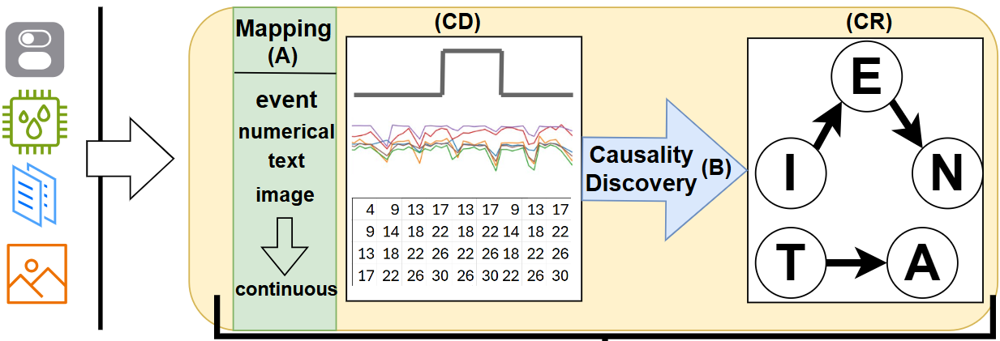
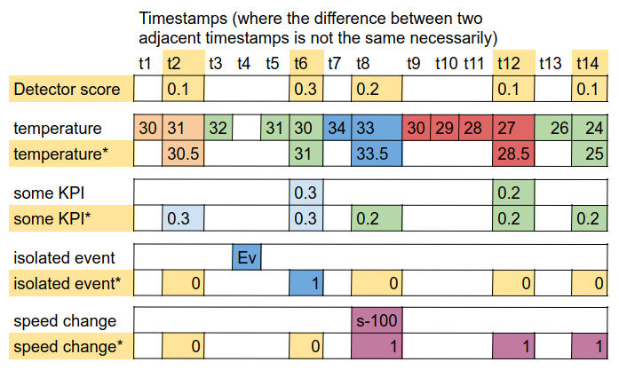

# Quick start <a class="anchor" id="Context-and-Data-types"></a>

**Context** is used to encapsulate all available multimodal information towards better Anomaly Detection solutions.

Essentially Context represents the available data existing in a time window (**context_horizon**), mapped from multimodal representation to multivariate time-series (**CD**), and their relationships (**CR**), where the relationships are extracted using **causal discovery** between the time-series of CD.

.

Context is implemented as an online process, where data are collected as they arrive. The arrival of a new value from a **target** series triggers the creation of a new context which includes: A) The mapping of availiable multimodal sources to multivariate time-series (**CR**) and  B) the application of a causality discovery to extract cause-effect relationships  between the available data sources in form of graph (**CR**).  


```
pip install PdMContext
```

## Instantiating a context generator:

For Intantiation we need to pass:
- **target**: string representing the name of target source.
- **context_horizon**: the length of time window of available used to build context
- **Causality_function**: a function that implements a causality discovery method (look at [Causality Discovery](#con-caus) )
- **mapping_functions**: a dictionary of the available types of monitored data sources and their corresponding mapper (look at [Mapping Function](#con-caus) ).

```python
from PdMContext.ContextGenerator import ContextGenerator
```

Or in case we want to use a Lighter version of context:
```python
from PdMContext.LightContextGenerator import ContextGenerator
```
Then we can instantiate a context generator as follows:

```python
con_gen=ContextGenerator(target="anomaly scores", context_horizon="8 hours",Causality_function,mapping_functions)
```

To feed a new sample from a data source to context we need (e.g. the temperature measured from Machine_A):
- **timestamp**: timestamp representing the time when the sample was collected (using pandas timestamps).
- **source**: A string which annotate the name of the source the sample derives.
- **name**: A string which represent the name of the time series related to the sample.
- **type**: This annotates the type (or the nature) of the sample (the type has to be one of the keys from **mapping_functions** dictionary)
```python
con_gen.collect_data(timestamp=t1, source="Machine_A", name="config", type="univariate")
```

Passing a sample from **target** source trigers the creation of new context.
```python
context=con_gen.collect_data(timestamp=t1, source="Machine_A", name="anomaly scores", type="univariate")
```

**PdmContext.utils.structure.Context** is used to represent such a context.


### Mapping Functions <a class="anchor" id="mapping-functions"></a>

Data sources can be any time series (producing information in time) of events, continuous values, images etc. 

To formulate context from the available data sources we have to define mapping functions: 

**mapping_functions**: A dictionary where the keys are the name of the different types of data sources and the value are python mapping classes, that handle to transform a time window of values observed from particular source (e.g. the events observed from a particular data source) and handles to transform them in a time series of the same length as a **target** one (the target is usually the anomaly scores).

For example, the default mapping_function used by the library is:
```python
mapping_functions = {
    "Univariate":map_univariate_to_continuous(), # represent continuous sources
    "isolated": map_isolated_to_continuous(), # represent sources of events with instant impact  
    "configuration": map_configuration_to_continuous(), # represent sources of events with constant impact  
    "categorical":map_categorical_to_continuous() # represent sources of catigorical values
}
```

The values are classes from **PdmContext.utils.mapping_functions** and have the following form:
```python
class map_name:
 
    def __init__(self):
        # possible code
        pass
    def map(self,target_series, occurrences,name):
        """
        
        target_series: the time series which will be used as guide to build a continuous representation for the particular type.
        occurrences: time series of observe value to be mapped
        name: the name of the time series to be mapped
        
        Both target series and occurrences has values in form of (sample, timestamp) where the sample contain the value (any data type).
        
        return the resulting vectors (usually just one vector) and names from mapping occurrences to time series format.
        """
    # possible methods
```


The way they transom a different sources in time series data can be seen in the following example:
- **target** : Detector score
- **isolated**: isolated event 
- **configuration**: speed change
- **Univariate**: temperature, some_KPI

.

### More details regarding the default mapping_functions:

#### Continuous (analog, real, Univariate series ...):

The **map_univariate_to_continuous** class handles the difference in sample rate of observed time-series which is mapped to the sample rate of a target-time-series called **target** series (also referred to in the code and documentation as such): 

1) For series with a sample rate higher than that of the target, the samples between two timestamps of target series, are aggregated (mean)
2) For series with lower sample rates, repetition of their values is used.

#### Discrete Events: 

The default mappers support also data which are not numeric, but related to some kind of event (events that occur in time). These are often referred to as discrete data. To this end, the Context supports two types of such events:

1) **isolated**: Events that have an instant impact when they occur.
2) **configuration**: Events that refer to a configuration change that has an impact after its occurrence.
3) **categorical**: Categorical events that refer to some kind of state (i.e. day of the week: Monday,...). Here each category is treated as configuration one, and a state variable is created which signal is one after the last change of category.

The map_isolated_to_continuous, map_configuration_to_continuous, map_categorical_to_continuous classes are used of to transform the occurrence of events into continuous space time-series and add them to **CD**.


## Causality Discovery Efficiency (not stable)

To calculate context we perform Causality Discovery over the mapped signals. Thus, causality discovery calculated is performed for every new observation of the target signal.
To deal with that we implement a moving Causality Discovery version of PC algorithm combined with Fishers z-transformation independence test. 
Under `utils.MovingPC` we implement the class `RunningCovarianceTimestamps()` which handle the calculation of aggregated signals' statistics on the fly, able to delete and add new data samples.
By that way the process of Causality Discovery becomes a lot faster, considering that as new target samples are observed there is little change to data (e.g. a few samples are added and subtracted from the context horizon)
This class is leveraged by `utils.MovingPC.MovingPC` and can be used by creating an object and passing the method calculate_with_pc_moving to the context generation class.

```python
from PdMContext.ContextGenerator import ContextGenerator
from PdMContext.utils.MovingPC import MovingPC

MPC=MovingPC()

con_gen=ContextGenerator(target="anomaly scores", context_horizon="8 hours",Causality_function=MPC.calculate_with_pc_moving)
```

Caution: In order to use this functionality there is on requirement, that the mapping functions produce stable transformations, meaning that the values of already observed timestamps
are not changing by the mapping function. 

The default mapping (Isolated, Configuration and Univariate) produce stable transformation except for the case of categorical values.